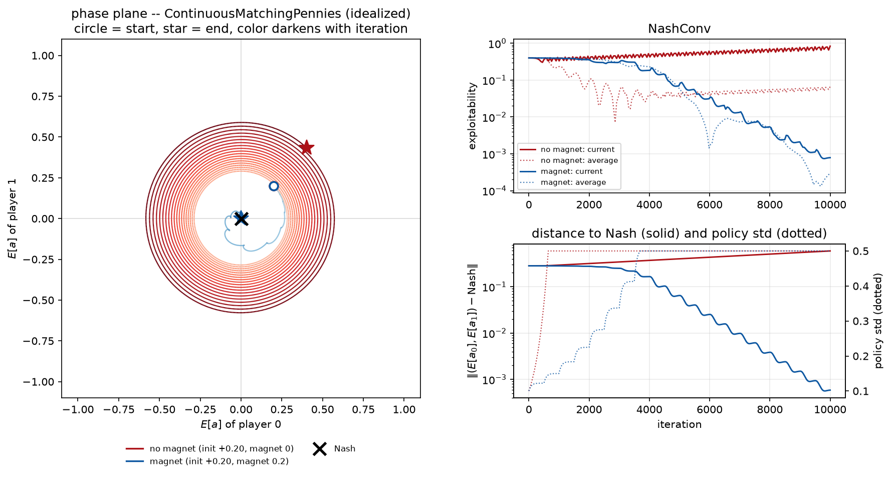
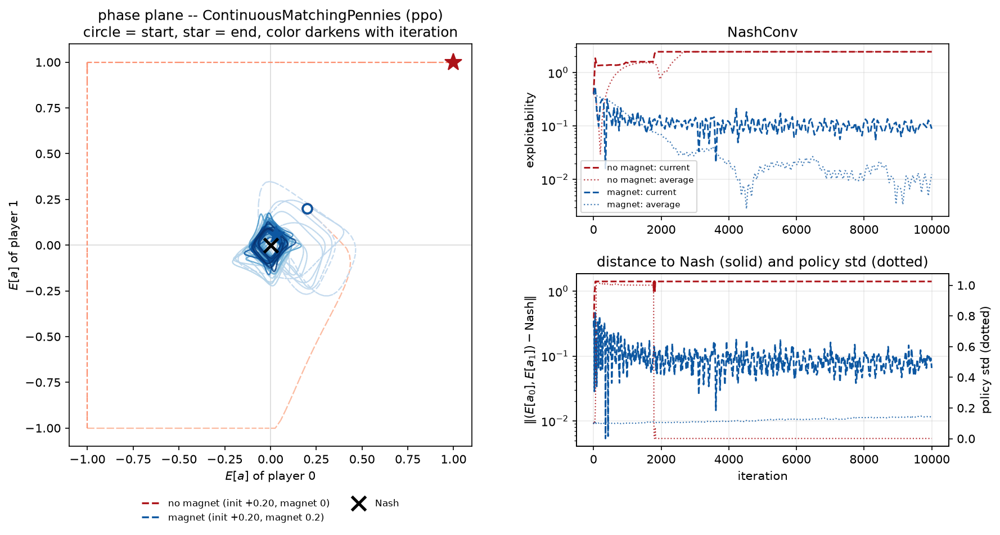
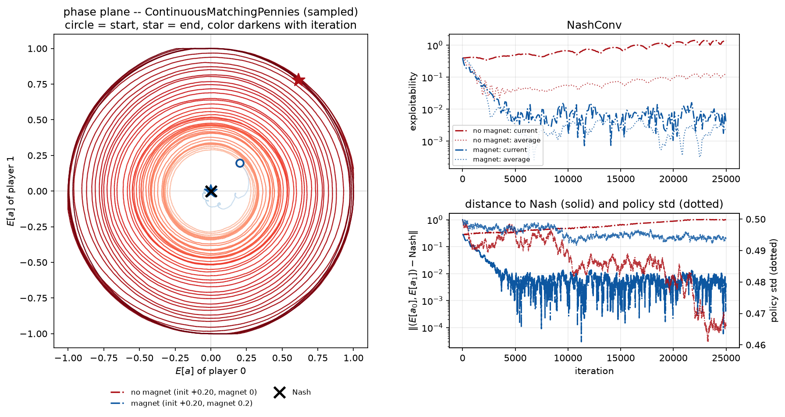

### September 3, 2026

I decided to use the PGDA proof. It is the easiest to follow and I do not think it matters that it is not as general and the Mirror Descent proof would be. Even then, it is 3-page proof. So right now the draft already have 7 pages, without introduction and any references. I am trying to think what should I focus on now, there are two important things: 1. Experimental section, baselines etc, 2. Theoretical section, actual proof that the mixture of Gaussians is trainable.

For the experimental section, I think Colonel Blotto is a good game to try. In that game, you have 2 players and N battlefield and M resources. Your goal is to distribute your resources such that the player that there are more battlefields where you have more resources than the opponent. The game itself is one-shot, where you decide immedietly, but I think there will be some extension that makes it sequential. One extension I am thinking of is that you are sending at the battlefields one-by-one sequentially, and everytime you only know whether you have won or not, but not how much. It is similar to Imperfect Information Goofspiel, but the change is that you are trying to win majority of rounds and you do not care about the card itself.

For the first time it seems I have a performance comparable to the Slumbot. After 15k hands, the average reward is 0. This does not have to mean that we are better, because the actual value is 0+-0.2 mbb/h. So I could be winning by a margin, or losing by a margin. But I was afraid that the strategy may get something like off-path degradation, which is that in parts of the tree where you get with probability 0, the performance will degrade, because you stop seeing it in the training. If I do another run, I will probably do something like 0.01-off policy. In such a large batch sizes like I am using (roughly 70k hands for single gradient step), even this small percentage is still reasonable. I started another continuation of the experimetn with this off policy sampling. I did not do any correction, byut with such a small probability, I hope it will be fine.

### September 2, 2026

I am working on the proofs for the paper and so far I managed to finalize the one that when you use Gaussian MD with single Gaussian it converges to a fixed point. Sadly it does not state anythinhg about the fixed point, because unlike the Discrete MMD, the optimal solution may lie beyond the feasible space. So in that case the optimal solution may not be Quantal Response Equilibrium. This weakens the paper, but I still think there is a potential in that.

Besides that I am about to try the new Poker training after roughly 400k iterations. I hope that the faster per-iteration speed and smarter usage of the allocated resources would allow me to push the performance. When I just checked the strategy it seemed fine (i.e. it does not play nonsense). But the proper test is running against Slumbot. After 3k hands the new checkpoint is winning 0.2bb/hand. I know that having high hopes after so few rounds is naive, but still, it would be awesome to have such results. After 100k hands I am at -0.1 bb/hand. And I rechecked the strategy. It seems that the network is folding much more now, and it is reasonable to do that, when your cards are bad and opponent just raised. Now I am thinking that the problem with the previous runs may have been too long of a training. That even with this approach you eventually go o.o.d. and therefore the strategy will become more and more exploitable in those parts (which breaks the whole story I have right now), but maybe it was something else before. Let's see whether the performance gets better going onwards, or worse.

I am quite embarassed about myself. In the new batch of experiments I started logging the average length of the game during training. It was 4 moves. My trajectory length was 35 and after the gamme ended I used padding. I burnt ~90% of the computation on padding. Note to myself for future projects is to keep track of those things and log them. I should've done it immedietly. Well, happens to the best of us, so now let's add more computational resources on it, and I am sure the Slumbot will fall.

Back to the proof; I thought I am already done, but then I thought about one secret assumption I didn't realize. The proof that the KL divergence is strongly monotone relies on the fact that the standard deviation is greater than 0, because otherwise you divide by 0. This sounds harmless, but it changes the Variational Inequalities, because now the fixed point does not have to be unique. So now I need to show that the point is unique and that the Mirror Descent converges to it. After conversation with Claude, it tries to convince me that I am actually using Projected Gradient Descent-Ascent, and that it provides better bound, so I am thinking that maybe I will prove it for this PGDA instead, as it may be simpler and better. But on the other hand, I do not think that I need strong bounds. Of course, the better bounds are better, but if it costs some explaining like what is going on, and that the code differs, then I think it is not worthy.

### September 1, 2026

Tried new training checkpoints from the HUNL training. It seems they are getting worse, The win-rate against Slumbot went down to -0.4 bb/hand. Not only that but the whole training was slower because of the added transformers for the card encoding and the history encoding. I found some small bugs, like when the mean or variance got out of the bounds, the gradient stopped flowing through them. I do not think this was the main problem, but it is better to avoid it.

I finally did one thing that I was avoiding, which was that for single gradient update I ran the game from beginning up until the end. So if the limit was 35 moves , but the game ended after 1, there were 34 noops. I always knew this was wasteful, but dealing with earlier termination and with avoiding value leakage etc. is a pain. Luckily with coding agents, these headache implementation become quite easy. Sure you need to double check it, but that is still better than writing from scratch. So this is now done and verified.

I also removed the transformers used for the encoders. Based on quick performance check, it seems that it will improve the iteration-speed 5-times. I also tried to change the hyperparameter settings. Claude is trying to convince me that the entropy is too high when I use 0.03. I do not believe it, with high entropy I would expect that you play all actions with non-zero probability, but all-in often goes to <0.0001 probability, similarly fold. But I think it does not hurt to experiment with it. I introduced annealing schedules for both entropy and learning rate. Previously I used learning rate 3e-4. Now I anneal from 1e-3 to 6e-5 using cosine decay. The entropy is annealed with exponential decay from 0.03 to 0.003. Let's see how that goes. From the Leduc experiments I do not think this is the issue. I had a lot of experiments previously on discrete Leduc, and there seems to be bound at exploitability at roughly 0.3 which I could not cross no matter what I did. The rewards are between -13 anad 13, so it is like 3%, but still, I would like it to go to 0. I managed to find out 2 things. One of the important knobs is the batch-size, second is the entropy. In Goofspiel, I had similar problem, but just smartly annealing entropy gradually made me converge to <1% exploitability. I experimented with alpha-entmax whether the problem is not that some actions should be played with 0 probability. Surprsingly the answer was no, it worked the same way.

Getting h200 on cluser is quite difficult now. It is the fastest GPU there, so it makes sense, but I am still missing the days where I could run the experiment and immedietly get assigend GPU for 72 hours. Now I sometimes have to wait for hours to get GPU even for 10 minutes experiment. There are 3 queues at the cluster  <4 hours, <24 hours, <72 hours. I even started using the 24 hours one, just to get slightly higher priority. I was thinking about a dick-move, that I would make the script run for 3 hours 50 minutes in the code and after that time, the training would cut off and the script will submit it's continuation into the queue for another 4 hours.With this infinite-GPU glitch I would have the highest priority all the time. But right now I am running always X iterations using lax.scan, so for the X iterations, there is not data sending between CPU and GPU, which could be bottleneck otherwise. I use quite X=20000. I do not want to mess up with this design, because the check would probably have to be more often than 20k. Moreover, the wait times for the 4 hours may actually not be that much shorter than the 24 hours I am using now, so this may be hurtful in the end.

As for the paper. I am thinking whether to prove everything using the Cholesky decomposition or whether to keep the Covariance matrix. Both work, but the covariance matrix just seems as a more natural concept, but then it does not correspond to the exact thing I am doing. I can see it going both ways, as using the Covariance matrix, the reviewers would tell me: This is not what you are actually doing, because your gradients are used on the Cholesky decompositon. And if I do the Cholesky decomposition than some reviewers would just not get it. Even now the paper is becoming difficult to follow, so I do not want to complicate things more.

I was also experimenting with the N-dimensional extension of the Continuous Matching Pennies. I used the simplest case f(x, y) = sum_i x_i y_i ... so it just sums the bilinear terms. Works exactly the same way, but the dimensions are independent, which I do not like. I would like to see whether I can find a game, where they will be dependent, have unique equilibrium, but still you could converge with the MMD. Finding such a game is more difficult than I thought. Claude also came up with game that is quite complicated, but it has similar oscillatory behavior and uses the cubic term. However, when you add magnet, it converges at the beginning and at some point, it just breaks. Increasing the magnet strength fixed this, so I think it was just that the learning constant was not satisfied in this experiment. Now it seems stable beyond 3000 iterations and it also works with the neural networks.

### August 31, 2026

I was thinking that maybe using the Gaussian reparametrization is not the best thing. Because of the known limitations like the variance always being greater than 0, which limits the convergence. So I was thinking about some other distribution. I tried to use the Exponential family, and by trying I mean I told Claude to implement it. This approach also works, but it is slower and on conceptual level it seems much more difficult. I did not find any benefit from using it. So I guess I'll just skip it for now. 

What about other distributions? I am not sure, the Gaussian is such a nice and easy distribution that I think I'll stick with it. Also it has been studied a lot with SAC, so it makes sense to just use this, then reinventing the wheel.

When I was writing the proof I noticed that when using multivariate (multidimensional) Gaussian, I just treated each axis separately (each had it's own mean and variance). But the KL divergence itself uses a covariance matrix. That's when I realized the approach I used is not particularly clever. After brief conversation with Gemini, it told me that training the covariance matrix directly is pretty bad idea, because you cannot guarantee it will be positive semi-definite and symmetric. Luckily, I am not the first person dealing with this, so I found out that Cholesky factorization is used for this. I did not learn about that particular decomposition on my linear algebra course. Which surprises me, because the whole decomposition of the symmetric positive semi-definite matrix into a single lower triangular matrix makes quite a lot of sense. I still do not understand SVD decomposition exactly, but this Cholesky factorization seemed easier. Good thing is that it naturally gives you both the symmetricity and definitness. Moreover, during training you do not need to materialize the whole matrix. 

I need to think of a game, where to try this. Some extension of Matching Pennies into multidimensional case would be nice. I would like to see how the magnet helps beyond the 1d toy example.

### August 30, 2026

I wanted to provide a non-convergence of the Gaussian reparametrization without magnet to some of my previous reports. But I forgot. But here it is, the first is the tabular version and second is when you use neural networks. I think those plots turned out better than I'd expect. Just seeing that if you do not use magnet, the strategy gradually gets further and further from the optimum is exactly what we wanted to show.

I was else experimenting with the Kuhn and Leduc Poker with continuous bets. Those games are great for our approach, because they combine the continuous and discrete actions and are sequential. Also since they are quite small, we may also be able to get analytical solution, which is nice. From the first experiment on having a discrete bet it seems that the algorithm finds similar quality of the strategy as the vanilla MMD (it shouldn't be moving the Gaussian head), so I think it passed the sanity check. Weird thing about Leduc with MMD is that there seems to be threshold of roughly 0.35 exploitability. No matter how much you tune hyperparameters I was never able to get any better. Not sure why that is. The game is small enough that I could print the whole strategy and see. But I was lazy to do it, I will probably try this after I finish the work on this paper, as this paper is now a priority.

I am also thinking about some sequential actions. Settings like two player auction, where players bid in some order, and they may change their bids later.

The gradient for the Gaussian head requires computing the integral. So far I tried to estimate it from the neighborhood using the grid (that is why the plots look so nice). I thought that I should try to use Monte Carlo samples instead. That is how the neural version works, so it is a middle-step between those two. Results are still nice.

### August 27, 2026

With Gemini, I think I was able to find first draft of the proof for the f(x, y) = xy case. It is possible to derive closed-form solution for the fixed magnet, so this can be used as a building block for the more general proof.

I think that in the case, where you have a pure Nash equilibrium, the function is Lipschitz, the proof will be quite straight-forward. I am in middle of working on it, and I think it can be really similar to that of MMD.

I was optimizing code a bit and running few more experiments. Not sure whether this was always the case or whether there was some change. But Sonnet 5 seems incapable of doing any task right and even if Opus 5 is really good, all of it codes contains so much useless comments that just orienting what the code does becomes a chore. A lot of people are recommending me to try the New GPT 5.6 models and I definitely will give them a try, because Anthropic is losing me.

Also I have started writing the paper. I was thinking that the Gaussian is just a means to an end to get a gradient. But when the magnet gets in and the entropy itself, parametrizing as Gaussian suddenly makes sense.

Most of the day I was writing the paper. I am not good with writing so it was quite slow. But besides that I tried the new Poker checkpoints. The improvements seem to be stagnating in gameplay against older checkpoints. But now I ran against Slumbot head-to-head play and after 25k hands the win-rate is -70 mbb/and. Could be luck, but I checked the strategy for big blind after first bet and it seems much more reasonable than before, let's see how it goes .

### August 26, 2026
When I come back to a codebase after some time, I am always slightly confused about what is going on. This has happened today. In a simple game, it is known that f(x, y)= xy does not converge using gradient ascent descent. So I ran my script that I had prepared over month ago for this, and it did converge. After discussion with Claude it was because of the poor setting, where instead of moving the Gaussian, I used the grid and computed a categorical distribution over this grid, which resulted in very quickly finding Nash. I changed the config, ran it and it did not converge. So I added the magnet, because I recall that with the magnet in the Gaussian space, it worked. I ran the code and it diverged. In that moment I was questioning what I remember and what is true. Luckily I found out that the problem was that I used unbounded variance for the Gaussian and sampling very off can push the dynamics in a way  it does not converge. This is a nice observation I should keep in mind when writing the paper. When I limited the variance, everything suddenly worked.

I would like to have a direct proof which says: This is the setting for hyperparameters that needs to be satisfied such that it works. Similarly, the MMD shows that the magnet needs to be greater than a Lipschitz constant. I know that these types of bounds are useless because in the big problems you cannot extract those constants from the problem definition, so you just vibe the hyperparameter and hope for the best. But it makes the result stronger.

### August 23, 2026
I implemented the combination of MMD and SAC in my codebase (https://github.com/kubicon/rlg) which I use for experimenting with policy-gradient algorithms and I ran the training in HUNL. Then I again matched it against Slumbot. Good news is that it does not suck as much as the discrete version, but still it loses roughly -0.2 bb/hand. This is not winning! I think the best part about it is that it completely avoids the problem with incompatible abstraction. There is no abstraction now, so during training the algorithm has likely seen all kinds of bets, even those that the Slumbot will make. I still believe this approach.

I tried couple more things, I changed the observations, such that the cards are encoded with transformer, the history is encoded also with transformer etc. It slowed the training, but it does not seem it improved anything. It seems that each new checkpoint is an improvement over the last one, but the improvements are quite marginal, so I am not sure whether I will be to beat Slumbot without algorithmical update. But I will keep the training running, and hopefully the improvements will still continue.

One of my friends, Chris, is working for GTOWizard and they also have their own API for their bot, and I had high hopes that I may be able to beat it. However GTOWizard is winning like 0.2 bb/hand against Slumbot. Sadly I am not close to those numbers. Unlike Slumbot, GTOWizard uses additional search during the gameplay, which makes evaluation against it even slower.

I will keep the training running for one more week. Let's see what will happen. I can still implement the additional test-time training which I have used in my paper to actually push it more slightly, but I would like to avoid for Slumbot at least, because when you do it, you cannot hunderds-of-thousands hands which I am doing right now.

### August 22, 2026
#### This summarizes all the progress made before starting this blog
My main research focus have beenon imperfect information games. Most of the advances in that field were because of Poker and I'll be honest. I do not like Poker. Not that I don't like the game itself, I just don't like it as a representative research benchmark. I never liked the fact that part of the performance was how good of an abstraction you can do. What should be the card abstraction? What should be the bet abstraction? etc. When I was growing up I saw the success with Atari games and also Go. One can argue that both of them used some abstraction. Atari treated the game as black-and-white and Go used rotational symmetries if I recall correctly. However, in Poker the action abstraction is huge part of the game. Otherwise you would have almost hunderds of actions which differ in 1 chip.

I always thought that better way to treat Poker is to think about it as an continuous action game, where you have a discrete component of fold. Still, I did not want to focus Poker so I avoided it this idea for a time. But for our latest paper (Safe Test-time Reinforcement Learning in Imperfect Information Games) I thought that I would do something I do not like and I'll use Poker as one of the domains for the experiment. I did even the thing I did not like the most, I used the card abstration. I do not recall which exactly, but it was something like betting 0.5x, 1x, 2x and 4x of the pot. The paper in a nutshell is that you train the neural network in self-play and then during gameplay you continue training that netwrok for couple of seconds to improve the current move. I let the Claude implement the domain itself, I ran the training for 6 days, then I play it and I find out that the ~1000 games I was able to run before the deadline were not even close to get some reasonable statistical significance. It would be require roughly 100-times more even with some variance reduction techniques. So sadly, all this was in vain and I did not include those results in the paper. 

But I trained those networks, so why not do something with them right? So, I just took the trained network and matched it against Slumbot, which is public Poker bot, that is not at the top-level, but it is still very strong. I avoided any of the additional test-time reasoning from the paper, I just wanted to have some baseline. I had to fix couple of issues, like when the Slumbot uses an action that is not in my abstraction. I know that this was a huge problem in the Poker in like 2015, so I tried their approaches to mix between the closest bets.

Can you guess how good was the trained network? I will tell you that if you immedietly fold after the small and big blind (which are the mandatory bets), your average reward would be -0.75bb/hand. The bb/hand unit is standartly used in Poker, and most of the time, in AI the small blind is 1 chip, big blind are 2 chips and each player starts with 400 chips (so 200 big blinds). The trained network was losing againt the Slumbot roughly -1bb/hand. It played so horribly, that folding would be a better option. Of course, this is slightly misleading because of the off-abstraction problem, but still, this was really bad.

As most of the people, I do not like losing and I did not want to lose in that spectacular way, so I thought about how to beat slumbot other way. I knew I wanted to avoid the usual CFR approaches, because I have spent quite a lot of my PhD on those, and the implementating it is quite a lot of work to get it right. I know that Claude Code will program it for me, so it wouldn't be as bad, but people have done this quite a lot since Deepstack/Libratus, I wanted to make it more interesting.

Basically all of my research career revolved around policy-gradient algorithms in imperfect information games (Regularized Nash Dyanmics, Magnetic Mirror Descent), so I wanted to do something with those, but the naive approach I used before just sucked. I started with the initial idea. Let's treat the actions as continuous, not as a discrete. Then I thought, that single-player reinforcement learning deals quite often with continuous actions, and algorithms like SAC do it by not generating single action, but generating distribution. Specifically, they have a network which or given state outputs 2 values, mean and variance of Gaussian distribution. Then they sample from this distrbution and play that. Training is quite straighforward, because it naturally provides gradient, when you sample from the distrbution you compare whether you improved over your critic, if so you move it closer to that, otherwise you move it further.

In single-player setting, we know that there is optimal strategy with variance = 0 at each decision, which means that you just use the mean. In imperfect information games, this does not hold, because the strategies are often mixed (play several actions with different probability). I think this makes intuitive sense, if you would always have the same bets with the same cards, then it can be exploited if someone notices this pattern. In human-language we would call it bluffing and it is known that the strong bots always employ some form of bluffing. So I thought, let's take the main idea of SAC, but instead of training single mean and variance for an action, let the network predict multiple means and variances and then train a distribution over them. This seemed so obvious to me, that I had to check whether someone has not did it in the past. I couldn't find anything (if someone reading this has explored this idea before me, I apologize for not doing my related work check thoroughly). I think it is mainly because imperfect information games are not popular and outside of them, you would just use the vanilla SAC with single mean.

So with this idea I started experimenting. The algorithm in my mind was combination of SAC and Magnetic Mirror Descent (MMD). The main idea is that the network outputs N means and variances and also categorical distribution over those N Gaussian distributions. The categorical head is trained with MMD, which is known to converge in matrix games and the Gaussian head is trained with the SAC loss. MMD uses a concept of magnet, which adds a KL divergence to the loss between this magnet and the current strategy. This may sound like just a hack that prevents large changes, but it can be actually shown that this is necessary to dampen the rotation in the gradients. Because of that, MMD converges to Nash equilibria, wheras PPO does not. I thought that since I am using the magnet already for the categorical loss, I would also use it for the Gaussian loss.

My knowledge of continuous action games is very weak, so I did not know where exactly shall I start. I tried to find some simple games as matching pennies in the continuous setting. But weird thing is that the game called continuous matching pennies do not have mixed equilibrium! I was quite surprised that even finding a well-studied class of games with mixed equilibria in continuous action games is difficult. So I just told Claude to generate a class of games, where I can use a parameter that specifies the position of the actions in the equilibrium support and distirbution across them, and it constructed such a game.

So I tried this in games with multiple equilibria, multi-dimensional inputs etc. and quite suprisingly, it always converged. I was shocked and thought to myself, this is an easy paper. But good things do not last forever, because I told Claude to create a counterexamples where it would not converge. Some counterexamples are obvious, for example if you have a Nash equilibrium that mixes between points -1 and 1, and you initialize both networks at 2, you just never reach the -1 (unless you variance is huge). Or if you have the same Nash, but you create artificial point at -0.5 which serves a a barrier, you also need a sufficient variance to jump over this point.

But even then I thought that these are reasonable constraints, and I should build a theory around it. My theory skills are not that impressive if I am honest, so I wanted to start with Fable 5 and I told him to find me the proof. And oh boy, I was not ready for this. It generated a 20-pages long LaTeX document with theorems and their proofs. I could not even understand what was going on in some parts. Then i spent like a week going back-and-forth with Opus 5 to simplify this in a form that I know what is going on and at the end, the result was maybe too simplified. I understood it, but it seemed like everything was kinda ... obvious. Is the paper doomed? I don't know, hopefully not, but I am not sure whether that is sufficient. ICLR deadline is in 3 weeks now. I think that if I focus, I will be able to do something about it. 
