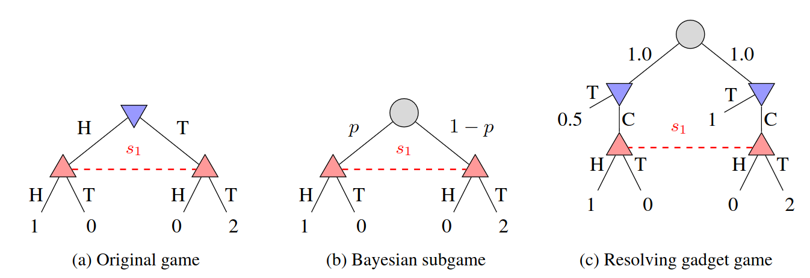

### August 30, 2026
#### This summarizes all the progress made before starting this blog. Paper will be soon available on arXiv.

Consider a large games that takes 100 turns and at each turn the branching factor is 10. At the end there are 10^100 possible situations. If you train any reinforcement learning algorithm in self-play, it is likely that in the second half of the game, that most of the trajectories were not seen during training. So when you are playing against an actual opponent, the performance in these parts rely heavily on the generalization from the training.

Even if the generalization capabilities of deep learning models are quite impressive, this is still too much to ask for. Algorithms like AlphaZero solves this problem in games like Chess or Go by running additional search during the gameplay, only from the current decision. This is a crucial part of these algorithms and without it, they can be beaten by strong players.

In imperfect information games, AlphaZero cannot be used, because the underlying state is not observed by both players. Not only that, but in those games when you change the strategy early in the game tree, it influences the strategy later. Also in imperfect information games, the equilibria are often mixed (the optimal strategy is a probability distrbution across several actions).

Since the state is not observed, there are several initial states in the subgame. Consider game on the following image, first blue chooses H or T and then red chooses H or T also with corresponding rewards to the red. If the red wants to find a strategy purely in this subgame without solving the whole game, there are 2 states it cannot distinguish between. However, the blue knows which action it has taken, so it knows whether the game is in left or right state.

The Bayesian approach (b) modifies the subame by adding a chance node which decides in which state the game is with some fixed probability. This probability is often extracted from some blueprint strategy that was precomputed, for example during training. It is quite obvious that if you solve such a subgame, the strategy will play well against the blueprint opponent, but if the actual player used different strategy, the newly computed strategy may be really weak against it. So the worst-case opponent will exploit this knowledge.

What is even worse, is that even if you would have the optimal blueprint (Nash equilibrium), you are still not guaranteed to play well against the worst-case opponent. This is the reason why some early Poker bots were not able to reach superhuman performance, because they often played well only against certain type of opponent.

Poker AIs like Deepstack and Libratus used an idea from CFR-D, where instead of assuming a fixed opponent, the opponent gets a hypothethical choice in the subgame to pick it's prior strategy. As such the resulting strategy is not strong against single type of opponent but it is robust to any opponent.

Another thing is that instead of approximating the Nash equilibriu, these algorithms serve as an improvement operator on the blueprint. So the algorithm takes blueprint as input, and produces a new strategy in the subgame and when you merge this strategy with the blueprint you will be at lesat as good as blueprint, and potentially beter. This approach is called "safe" search in imperfect information games.

The gadget games require to start from the public state, which is a set of all states closed under information available to both players (public information). In other words, those are all states that both players 100% know the game is in, while being aware the opponent has the same information. For example in Poker those are all hands both players can have. In Texas Hold'em it is roughly 1.5 million states. So both Deepstack and Libratus constructed the gadget game explicitly and then they just solved it.

I was more focused on games like Dark Chess or Stratego, which have much more hidden information, so this explicit construction is not really possible.

The whole idea of the paper is to use the gadget game, but run the additional training with the policy-gradient algorithm, where the blueprint is a neural network. In that regard the paper have 2 main contributions. It introduces a transformer model that is trained to sample the states based on the distribution required for that particular gadget game. For the unsafe approach it just samples proportional to bluepirnt, for the safe resolving gadget it is unbiased in the opponent's strategy. Second contribution is to train additional actor in the gadget nodes of the resolving gadget (light blue nodes in (c)), which are not present in the original game.

